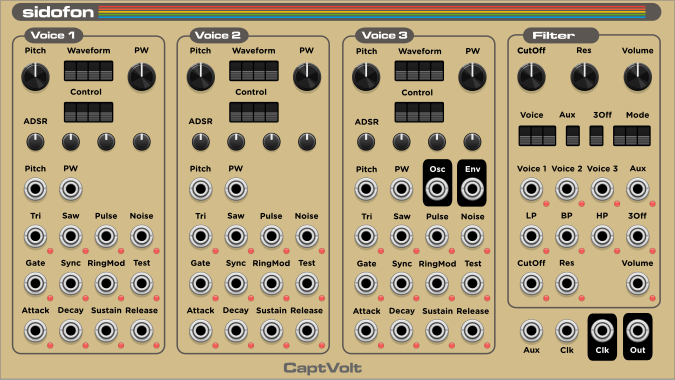

# CaptVolt's VCV Modules

##   sidofon 

Add Commodore 64's famous SID Chip (6681 or 8580) as a module to your VCV Rack.

Using Doug Lem's very accurate [ReSID][1] Emulation the module offers raw
access to all registers of the SID on bit level. Each parameter is mapped to
corresponding CV inputs. Additionally, manual controls are available.

We assume that you are familar with the SID's registers. If not the 
[SID 6851 data sheet][2] is a must read.

Both SID types 6581 and 8580 can be emulated. Select the desired type in the
modules menu.

[1]: ./src/resid/README
[2]: http://archive.6502.org/datasheets/mos_6581_sid.pdf

### General Notes

The module's parameters can be either controlled manually by specific controls
or via CV input. 

Note that always both the voltage derived from the control is added to the
CV. So make sure to completely disable a manual control in order to have
full control via CV.

For toggle/switch like controls the module offers a DIP switch. For 
continous values a normal or trim pot is available.

For switches an input CV of >= 1V enabled it. Range values are typically
mapped from the unipolar (0-10V) CV range.

### Register Clocking

As the SID digitally controls its parameters its update rate was not 
continuous or immediate but happened when the CPU was able to write the
registers of the SID.

In order to simulate this characteristic 8-bit sound generation this module
also does update the register values (here provided by CVs or manually) only
in a given rate. The `Clk` input allows to feed in this update clock from
an external source.

If no input clock is given then the module synthesizes its own clock available
on the `Clk` output. In most applications the SID registers were written in
regular intervals e.g. based on the vertical refresh rate. The generated clock
is also based on either 50 Hz (PAL) or 60 Hz (NTSC) depending on the
television norm of your county. It also allows to oversample this clock by
a fixed factor to achieve higher update rates.

The module menu allows to configure the internal clock settings.

Each CV input has a small LED that shows its current value: either off or 
increasing values with increasing brightness. This LEDs are updated when
the internal registers of the SID are updated and thus visualize the 
update rate.

### Voice Section

For each of the SID's 3 Voices a voice section is available in the module with
the following parameters:

#### Pitch

Oscillator Pitch mapps 1V/Oct input signal to the `FreqHi/FreqLo` register.

#### PW

Maps a bipolar CV to the pulse width of the rectangle waveform. 0V is 50%,
<=-1V is 0%, and >=1V is 100% duty cycle

#### Waveform

Select one or multiple waveforms for the voice by manually toggling the
DIP switches or by applying a switch CV of >= 1V.

The `Tri`, `Saw`, `Pulse`, and `Noise` CVs set the corresponding waveform
bit for this voice.

#### Control Bits

`Gate`, `Sync`, `RingMod`, and `Test` directly map to the bits 0 to 3 in the
voice control register.

#### ADSR

The ADSR values are converted to the discrete (0-15 range) values in the
SID registers. The full unipolar range 0-10V of a CV is mapped.

### Filter Section

#### Filter Cut Off

Control the cut off frequency in the `FC low/high` register of the SID.
The unipolar range of the CV (0-10V) is mapped to the discrete range
0-2047.

#### Filter Resonance

Adjust the filter resonance value. The unipolar range of the CV (0-10V)
is mapped to the discrete range 0-15 in the SID register.

#### Main Volume

Adjust the main output volume of the SID chip. The unipolar range of the CV
(0-10V) is mapped to the discrete range 0-15 in the SID register.

#### Filter Voice 1-3, Aux

These switches allow to control which voice is affected by the filter.
Additionally, you can also filter an external audio stream fed in via
the `Aux` input.

#### Filter Mode: LP, BP, HP

Select the filter operation mode: Low-pass, band-pass, or high-pass.
Use the `Mode` DIP switches to manually select the filter.
CVs are switch like (>=1V is on).

#### Disable Voice 3: 3Off

A switch controlling the `3Off` bit in the `Mode/Vol` register of the SID.

### I/O Section

Input `Clk` allows to feed in the register update clock via an external source.

Input `Aux` feeds in an external audio stream for filtering

Output `Clk` either replicates the input `Clk` if connected or outputs a
synthesized vertical refresh clock of 50Hz or 60Hz with optional oversampling.

Output `Out` outputs the mixed audio signal of the SID chip containing
all three voices and the aux input. All are passed either dry or filtered.
